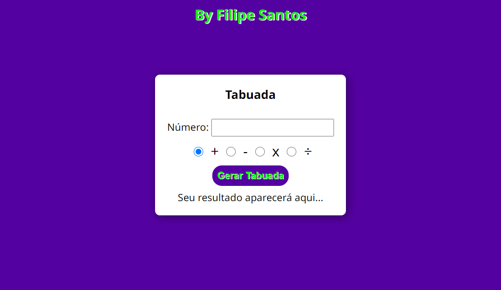

# Analizador de números

> Desafio do Curso de JavaScript

Nesse projeto eu fiz do zero uma tabuada que foi o desafio do curso de javascript do curso em vídeo. Era pra ser uma tabuada simples de multiplicação, mas eu adicionei vários inputs do tipo radio pro usuário poder escolher entre qual operador aritmético utilizar na operação. Ficou muito linda e funcional!

[🔗 Clique aqui para acessar]()

## 🛠️ Tecnologias

- HTML
- CSS
- JavaScript

## 💛 Contato

outerspaceguy@live.co.uk
